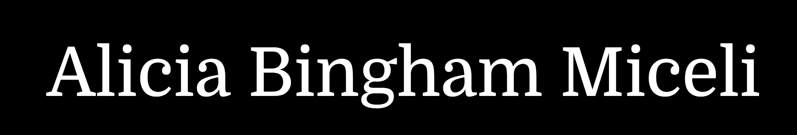

#Read Me

##Description
This is my portfolio website, aliciamiceli.com. It feels a bit like code-ception because GitHub and aliciamiceli.com link back and forth to each other, but I like having the code hosted on GitHub.



## How to run
In your terminal, run:
```
http-server -p 4040
```
then navigate to http://127.0.0.1:4040 in your browser.

## Contributors
- [Alicia Miceli](http://github.com/aliciamiceli)

